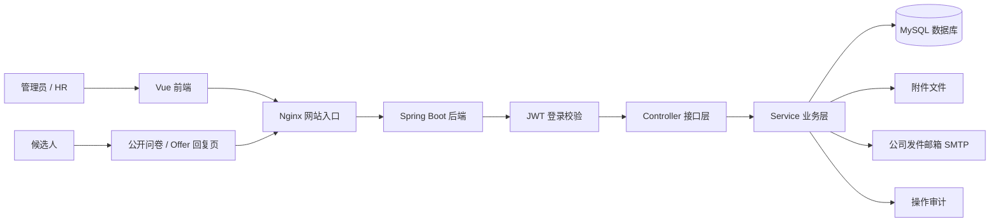
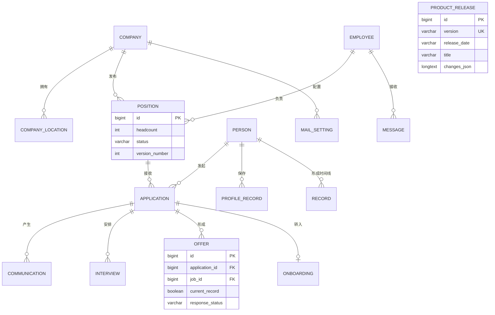
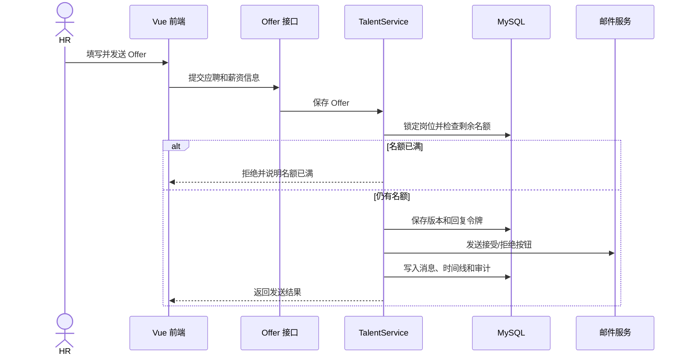
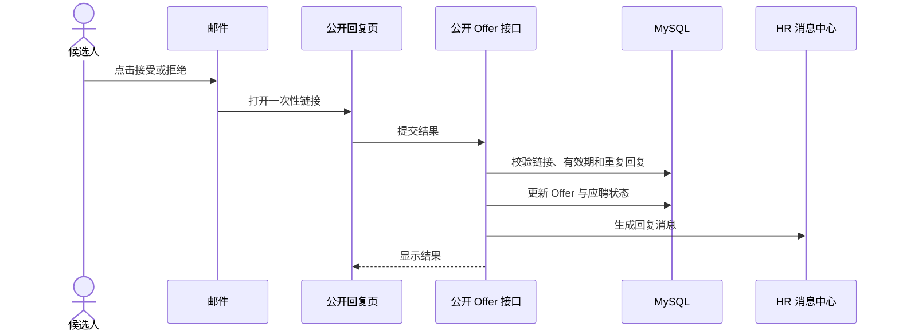
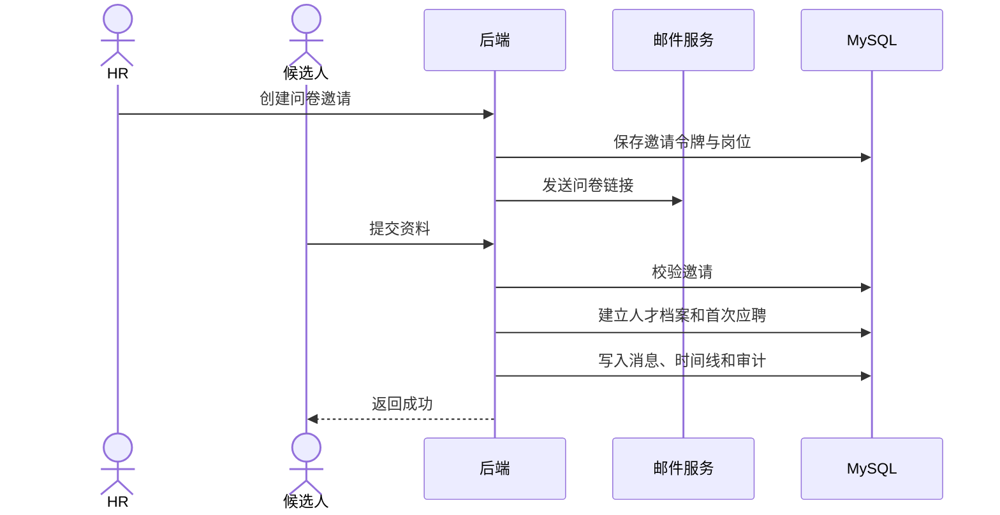

# 人才管理系统后端架构与接口说明

> 当前版本：V1.0.3；更新时间：2026-10-01

## 整体架构

网页是“前台窗口”，后端是“办事人员”，MySQL 是“档案柜”，邮件服务是“邮局”。



| 层 | 原词 | 大白话作用 |
|---|---|---|
| 前端 | Vue Frontend | 展示页面、收集表单、调用接口。 |
| 网站入口 | Nginx | 把网页请求和接口请求送到正确位置。 |
| 接口层 | Controller | 接住网址请求，交给对应业务。 |
| 业务层 | Service | 执行业务规则，例如名额满后拒绝创建 Offer。 |
| 数据层 | MySQL | 保存人才、岗位、面试、Offer 和版本记录。 |
| 文件层 | File Storage | 保存证件照、简历和入职附件。 |
| 邮件层 | SMTP | 发送问卷和 Offer。 |
| 审计层 | Audit | 记录谁在何时改了什么。 |

## 后端代码结构

```text
back/src/main/java/com/example/demo/
├─ controller/   接口入口
├─ service/      业务规则
├─ security/     登录令牌和权限
├─ config/       系统配置和异常处理
├─ common/       公共格式与工具
└─ exception/    业务错误
```

| 服务 | 作用 |
|---|---|
| `TalentService` | 人才、岗位、应聘、沟通、面试、Offer、入职主流程。 |
| `AuthService` | 首次初始化、登录、密码和令牌。 |
| `AssetFileService` | 附件校验、保存、下载、预览。 |
| `OfferMailService` | 生成并发送 Offer 邮件。 |
| `QuestionnaireMailService` | 生成并发送人才问卷邮件。 |
| `MailSettingsService` | 加密保存公司发件邮箱配置。 |
| `ReleaseService` | 从 `product_release` 表读取版本历史。 |
| `SchemaMigration` | 启动时自动补齐数据库表和字段。 |
| `AuditService` | 保存操作和变更字段。 |

## ER 图：数据库关系

ER（Entity Relationship，实体关系）图表示“哪些档案互相认识”。`1` 是一条，`N` 是多条。



岗位人数口径：`headcount` 是总名额；`hiredCount` 是已入职人数；`occupiedCount` 是已入职，加上已发送且有效、未拒绝的 Offer；`remainingCount` 是剩余名额。后端保存 Offer 时会锁定岗位并再次检查，不能靠改网页绕过。

## 时序图：关键流程

### HR 创建并发送 Offer



### 候选人在邮件中回复 Offer



### 人才填写公开问卷



## 接口及作用

除公开接口外，都需要 `Authorization: Bearer ...` 登录令牌（临时通行证）。

### 登录

| 方法 | 地址 | 作用 |
|---|---|---|
| GET | `/auth/setup/status` | 判断是否需要首次创建管理员。 |
| POST | `/auth/setup` | 首次创建组织和管理员。 |
| POST | `/auth/login` | 登录并返回令牌。 |

### 人才与资料

| 方法 | 地址 | 作用 |
|---|---|---|
| GET | `/candidate/list` | 分页搜索人才。 |
| GET | `/candidate/duplicates` | 检查重复人才。 |
| GET | `/candidate/{id}` | 读取完整人才档案。 |
| POST | `/candidate` | 新建人才和首次应聘。 |
| PUT | `/candidate/{id}` | 修改基本资料。 |
| POST/PUT | `/candidate/{id}/records/{type}` | 新建或修改沟通、面试、Offer、任职等记录。 |
| POST | `/candidate/{id}/assets` | 上传附件。 |
| DELETE | `/candidate/{id}/assets/{assetId}` | 删除一份指定附件。 |
| GET | `/candidate/{id}/assets/{assetId}/download` | 下载附件。 |
| GET | `/candidate/{id}/assets/{assetId}/preview` | 预览附件。 |

### 岗位

| 方法 | 地址 | 作用 |
|---|---|---|
| GET | `/position/list` | 获取岗位、名额、已招、Offer 占用和剩余数。 |
| GET | `/position/{id}` | 获取岗位详情。 |
| GET | `/position/{id}/versions` | 获取岗位历史版本。 |
| POST | `/position` | 新建岗位。 |
| PUT | `/position/{id}` | 修改岗位并保存新版本。 |
| PUT | `/position/{id}/status` | 暂停、关闭或重开岗位。 |

### 公司与员工

| 方法 | 地址 | 作用 |
|---|---|---|
| GET | `/company/list` | 获取公司和办公地点。 |
| GET | `/employee/list` | 获取员工。 |
| GET | `/hr/list` | 获取招聘负责人。 |
| PUT | `/employee/{id}/role` | 设置或取消 HR 角色。 |
| PUT | `/employee/{id}/account` | 更新员工登录账号。 |

### 公开流程

| 方法 | 地址 | 作用 |
|---|---|---|
| POST | `/questionnaire-invitations` | 创建并发送问卷。 |
| GET/POST | `/public/questionnaires/{token}` | 打开或提交人才问卷。 |
| GET | `/public/positions` | 读取可招聘岗位。 |
| GET | `/public/offers/{token}` | 读取候选人的 Offer。 |
| POST | `/public/offers/{token}/response` | 直接接受或拒绝 Offer。 |

### 工作台、消息与设置

| 方法 | 地址 | 作用 |
|---|---|---|
| GET | `/workspace` | 一次读取招聘各页面所需数据。 |
| GET | `/audit` | 读取操作审计。 |
| GET | `/inbox` | 读取消息中心。 |
| PUT | `/inbox/{messageId}/read` | 标记一条已读。 |
| PUT | `/inbox/read-all` | 全部标记已读。 |
| GET/PUT | `/settings/mail` | 读取或加密保存发件邮箱。 |
| POST | `/settings/mail/test` | 发送测试邮件。 |
| GET | `/releases` | 从数据库读取当前版本和历史版本。 |

## 软件工程判断

当前适合保持“单体应用（Monolith，一个后端程序）+ 清晰分层”。它部署简单、数据一致、排错直接。现在拆成微服务（Microservices，多个独立后端程序）会增加网络、部署和排错成本，不推荐。

已完成：接口按业务拆分；附件、认证、邮件、版本、审计独立；删除未使用的旧实体、旧 Mapper 和演示初始化代码；岗位名额由后端统一校验；本地与服务器使用同一套启动迁移。

当前风险：`TalentService` 仍较大，继续扩展时应拆为岗位招聘、Offer、入职三个服务；本地库和服务器库是两套业务数据，代码同步不代表数据自动同步；服务器 Git 与部署在同一台机器，仍需 GitHub 私有仓库做异地备份。
